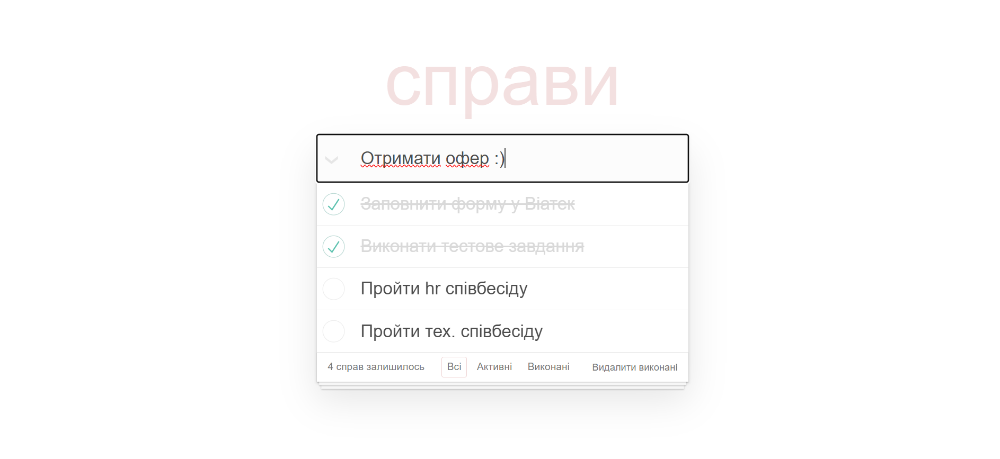
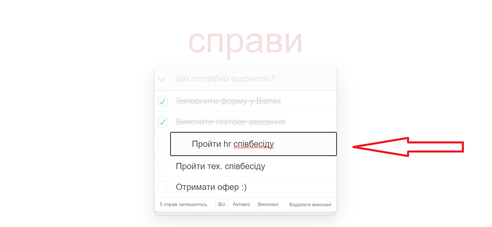
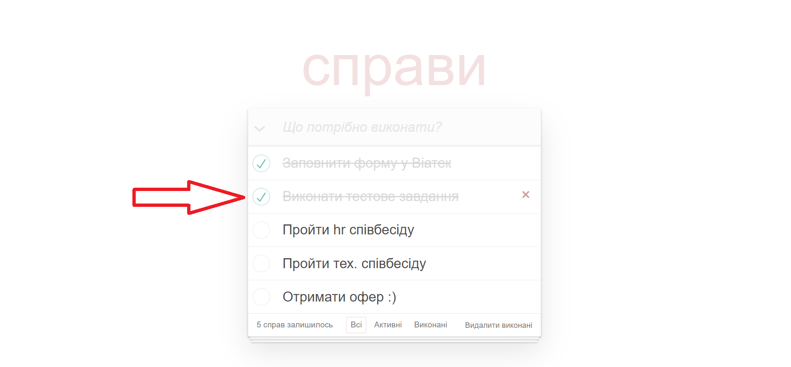
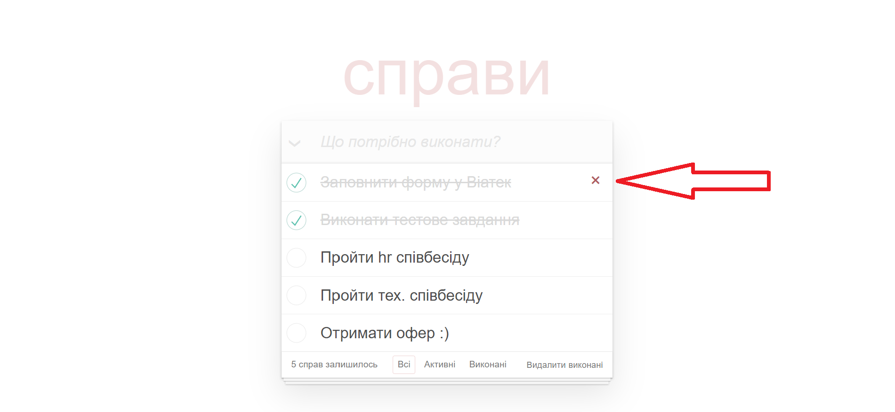
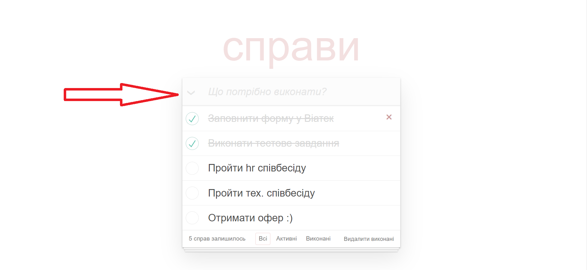
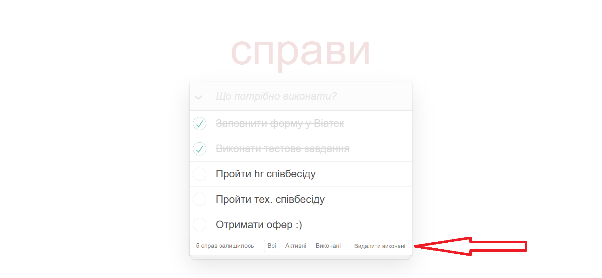
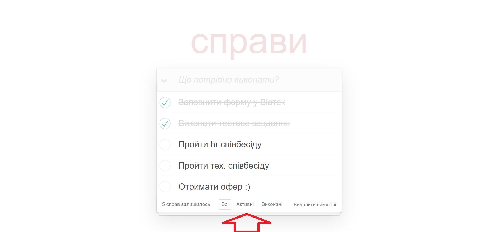
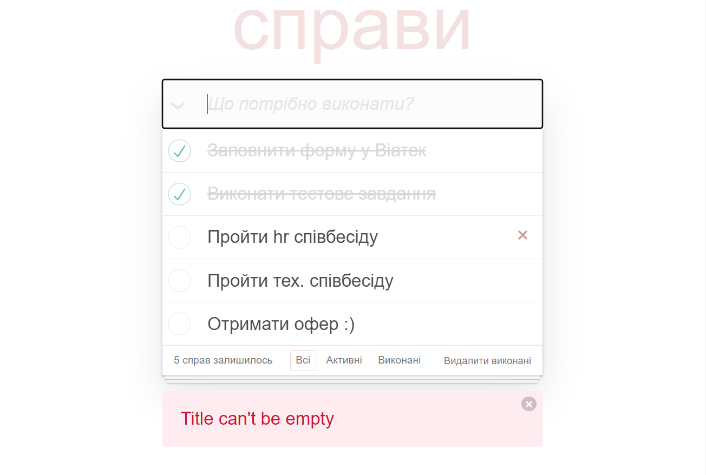
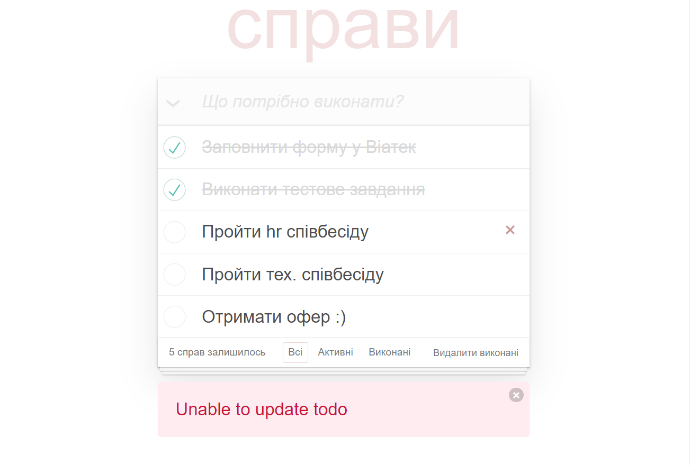

# Todo Application
This is a simple Todo application built with TypeScript, React, Redux Toolkit, Bulma (for styling), and SCSS. The application allows users to manage their tasks by performing various actions such as adding new todos, editing existing todos, marking todos as completed, deleting todos, and more.

---

[DEMO](https://igoroksentyuk.github.io/viatec-todos)

---

## Features
### Task Management
#### Add New Todo: 
Users can add new tasks to their list by entering a title and hitting the __"Enter"__ key.

#### Edit Todo: 
__Double-clicking__ on a task allows users to edit the title of the todo.

#### Mark Todo as Completed: 
Users can mark todos as completed by __clicking the checkbox__ before the todo.

#### Delete Todo: 
Tasks can be removed from the list by __clicking the "×"__ button next to the todo.

### Bulk Operations
#### Mark All as Completed: 
Users can mark all todos as completed with a single __click on the check mark__.

#### Delete All Completed:
To remove completed tasks, users can use the __"Clear Completed"__ button.

### Filter Todos
__View All, Active, and Completed Todos:__ Users can filter their task list to display __all, active, or completed__ todos. This helps in managing tasks efficiently.

---

## Error Handling
#### Empty Title Error:
If a user tries to add a todo with an empty title, an error message will be displayed.

#### Error Messages:
The application provides informative error messages in case of issues related to fetching, adding, updating, or deleting todos, especially when dealing with the fake API.

---

## Technologies Used
* TypeScript;
* React; 
* Redux Toolkit; 
* Bulma; 
* SCSS; 
* Fake API.

---

## How to run
* git clone https://github.com/IgorOksentyuk/viatec-todos.git
* npm install
* npm start
